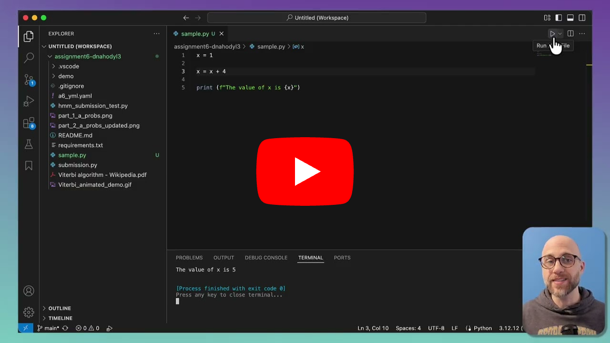
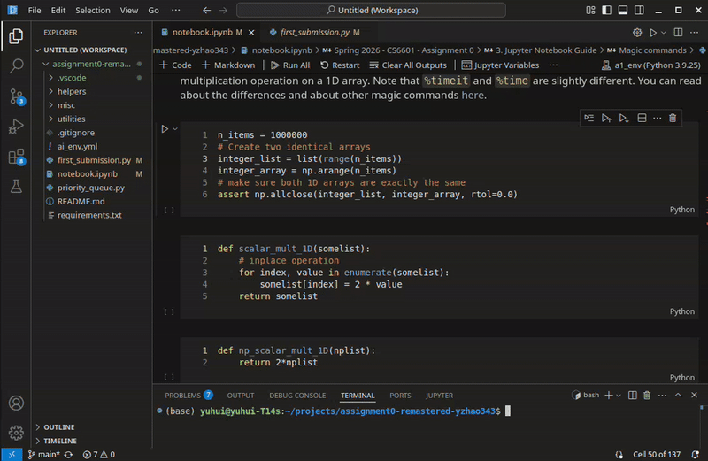
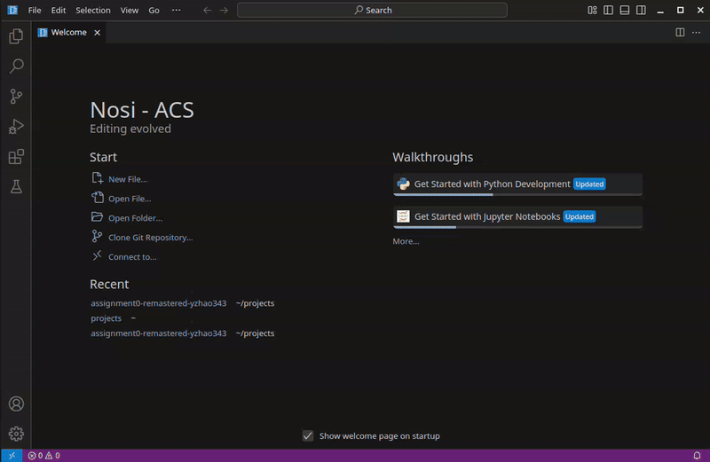
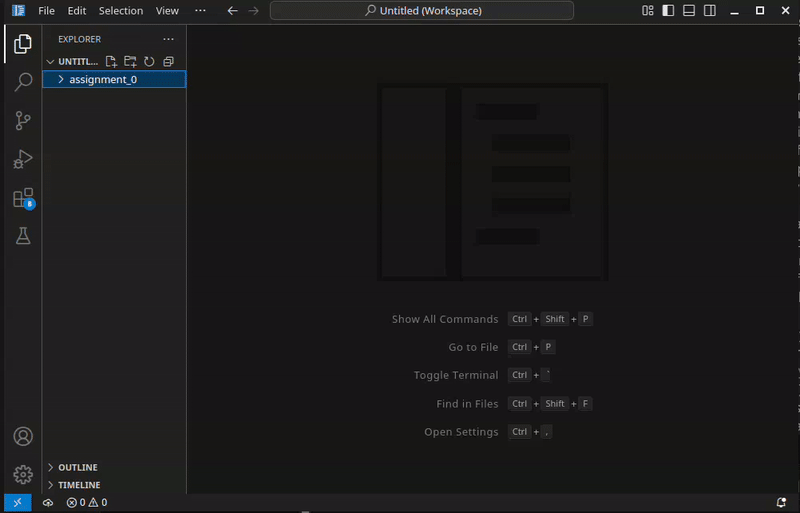
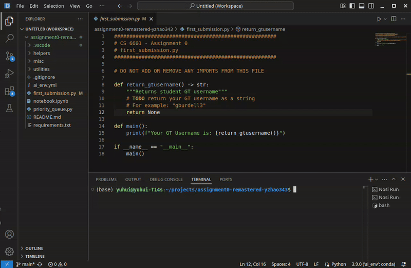
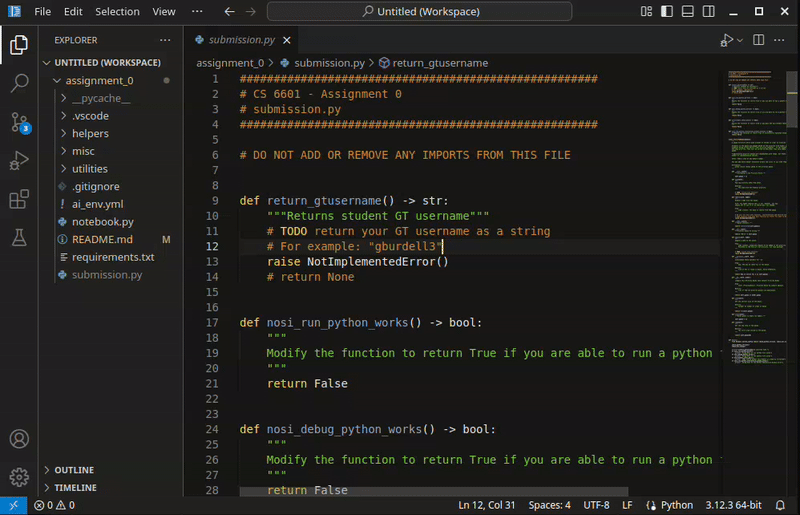
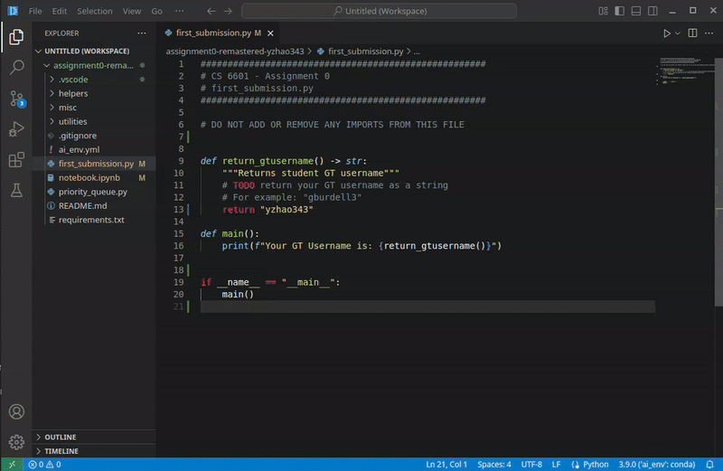
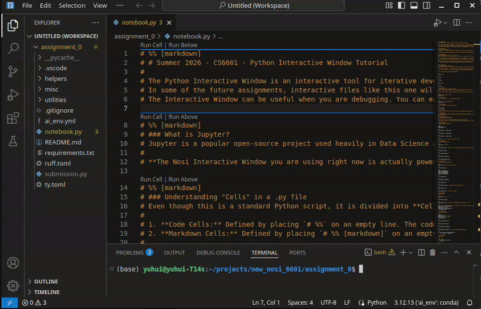

# Fall 2026 - CS7642 - Assignment 0

## Instructors: Dr. Rodrigo Borela Valente and Miguel Morales

## Deadline: <font color = 'red'>Monday, August 31st, 8:00 am ET</font>

#### Released: Tuesday, August 25th, 2026, 8:00 am ET

This assignment is designed to help you get comfortable with the software tools you will need to complete projects 1 through 3 in the course. In this assignment, you will get familiar with your local Python environment and learn some commonly used Git commands. You will install and get familiar with the Nosi Anti-Cheating Software (Nosi - ACS, [link](https://github.gatech.edu/gatech-edtech-team/Nosi)) as the integrated development environment (IDE) to finish the coding assignments in the course. Specifically, for this course, you will use Nosi v0.0.8. Additionally, this assignment provides a refresher on the Python programming language, introduces you to the Python Interactive Window, and guides you to use Gradescope to submit your assignment. After following the setup process in this README, you will finish `submission.py` to make your first graded submission! It is **HIGHLY** recommended that you read through the entire assignment instruction before starting. Let's get started!

If you have not set up your Python environment for this course yet,

#### STOP!
In this course, we will use Python version 3.12 for all projects. Following the guide below, you will install a Python environment that works for **ALL** subsequent projects in the course.

You can create the Python environment using Anaconda **or** miniconda ([link](https://www.anaconda.com/download/success?reg=skipped)) using the provided `rl_env.yml` file or the `requirements.txt` file. You can find those files in the repository's root directory. If you are reading this on a GitHub page, you can find all the repository files at the top of the page, above the `README` section.

 1. Install [Anaconda](https://www.anaconda.com/download/success?reg=skipped) or [miniconda](https://www.anaconda.com/docs/getting-started/miniconda/install).
 2. Open a terminal window and run `conda create --name rl_env python=3.12` to create a Python virtual environment called `rl_env`, with a python version = 3.12.
 3. Activate your newly created environment by running `conda activate rl_env` in the terminal.
 4. Download the `requirements.txt` file, or find it after you clone or download this repository.
 5. In the same terminal where you activated your `rl_env` environment, run `pip install -r /path/to/requirements.txt` (replace `/path/to/` to the path the file is in, for example ~/Downloads/)

 Alternatively, you can use the provided `.yml` file to configure everything (create the environment, install Python 3.12, install dependencies).
 1. Install [Anaconda](https://www.anaconda.com/download) or [miniconda](https://www.anaconda.com/docs/getting-started/miniconda/install).
 2. Download the `rl_env.yml` file, or find it after you clone or download this repository.
 3. run `conda env create -f path/to/rl_env.yml` (replace `/path/to/` to the path the file is in, for example ~/Downloads/)

 **NOTE:** Nosi does not currently support installing a python environment under a subdirectory of a project (e.g., `./.venv`). Officially, the course staff will only support the default conda way of managing the environment.

### Table of Contents
 - [Nosi Install](#nosi-install)
 - [Nosi Introduction](#nosi-introduction)
 - [Nosi customization](#nosi-customization)
 - [Setup a local repository](#setup-a-local-repository)
 - [Optional git tutorial](#optional-git-tutorial)
 - [Nosi Operations](#nosi-operations)
 - [Warmup: Discounted Return](#warmup-discounted-return)

## Nosi install

This semester, you will use the Nosi IDE as your tool to finish the coding projects. It is a [VS Code](https://code.visualstudio.com/) fork we built in-house to help enforce the course's antiplagiarism policies. Nosi removed AI/LLM features in VS Code, added friction to use AI tools, and keeps a record of your interactions with the assignment files. Unless explicitly stated, we don't allow the use of large language models (LLMs) to generate code when completing your coding projects. For the purpose of this course, you will treat LLMs as people. You are not allowed to share your code with another person, and you are not allowed to view or obtain code from another person. The coding assignments we distribute to you are encrypted. Nosi IDE is your only way to view, edit, and run your assignment files. Your editing interactions with the assignment files are logged and analyzed to detect potential violations.

To install Nosi, please access the Nosi GitHub Page ([link](https://github.gatech.edu/gatech-edtech-team/Nosi)). This GitHub page contains all the information about Nosi, including common operation tips and a troubleshooting guide. You can locate the v0.0.8 release of Nosi from the right panel -> Releases, or use this [link](https://github.gatech.edu/gatech-edtech-team/Nosi/releases). Under Assets, you should see the binary installers for all the OS & chip architecture Nosi supports. You only need to download the installer for your setup. Make sure you select the correct installer for your operating system and chip architecture. If you have multiple computers and/or multiple OSes, feel free to install Nosi on multiple machines and use them together. We recommend using Git to sync your work across different computers. You can also install Nosi on your Georgia Tech VLab virtual machine [link](https://mycloud.gatech.edu) if your system is not supported or you want to run Nosi in an isolated environment. You can also install and run Nosi in a self-managed virtual machine (WSL2, VMware, VirtualBox).

Below are the installation guides for different operating systems. Please make sure you install Nosi first before proceeding to the next part of the assignment.

### Windows

Windows installers end with `.exe`. There are four different `.exe` files for different setups. Most people's computers should use the `x64` architecture (also called `x86_64` or `amd64`) with an Intel or AMD CPU. Some recent laptops may use an `arm64` architecture CPU (e.g., anything with a Qualcomm Snapdragon). You can use the `system-setup` installer for all users, or `user-setup` for only your user account. For example, the installer for an x64 user account only setup is named `nosi-acs-v0.0.8-x64-user-VSCodeSetup.exe`. This is also the installer to use if you are installing Nosi on your Georgia Tech VLab virtual machine.

### MacOS

Please download the `.dmg` image based on your chip architecture. If you are using a MacOS device with an Apple silicon M-series CPU (M1-M5), please use `Nosi-acs-v0.0.8-Apple-Silicon-Installer.dmg`. If you are using an older MacOS device with an Intel CPU, please use `Nosi-acs-v0.0.8-Intel-Installer.dmg`. Download the dmg file, double click to open, and drag the `Nosi - ACS.app` icon to the `Applications` folder. If Nosi is extremely slow for you, it is likely that you installed the Intel version on an Apple Silicon machine, and it is running with emulation. Please uninstall Nosi and use the correct installer.

### Linux

We built nosi for a variety of formats to cover the most popular distributions. Both `x64` (`x86_64`, `amd64`) and `arm64` (aarch64) architectures are built. Please download the format you want based on your distribution. Linux distributions also work in the Windows Subsystem for Linux (WSL). Though you may experience some sporadic graphics rendering issues for some machines with high-resolution displays (e.g., the mouse cursor may be misaligned until you resize the window by Win + Left/Right Arrow).

### Install .deb on Ubuntu (Debian)

`sudo dpkg -i /path/to/nosi-acs-xxxxx.deb`

### Install .rpm on Fedora/CentOS/RHEL:

`sudo dnf install /path/to/nosi-acs-xxxxx.rpm`

### Install .snap file on Linux:

 * Make sure snapd is installed: `sudo apt install snapd`
 * Install the .snap file: `sudo snap install /path/to/nosi-acs-xxxxx.snap --dangerous --classic`

### Using the portable AppImage format

Running AppImage on Fedora/CentOS/Red Hat Enterprise Linux (RHEL):

 * Install fuse-libs, which is required to run AppImage: `sudo dnf install fuse-libs`
 * Change AppImage permission: `chmod +x /path/to/nosi-acs-xxxxx.AppImage`

Run AppImage: `/path/to/nosi-acs-xxxxx.AppImage`, Or Just right click, and click Run.

### Running AppImage on Ubuntu (Debian)

Change AppImage permission: `chmod +x /path/to/nosi-acs-xxxxx.AppImage`

Double click nosi-acs-xxxxx.AppImage or run in terminal: `/path/to/nosi-acs-xxxxx.AppImage`

### Launching nosi on Linux:

Find nosi-acs IDE in the desktop app launcher

Type nosi-acs in a terminal and then press enter


## Nosi introduction
Please watch the YouTube video introduction for Nosi to learn more about common Nosi operations ([link](https://youtu.be/gBhq2nH-JMs)).


[](https://www.youtube.com/watch?v=gBhq2nH-JMs)

We will guide you to try out Nosi in the latter part of this assignment as well. You can check out more information about Nosi on the Nosi GitHub Page ([link](https://github.gatech.edu/gatech-edtech-team/Nosi))

## Nosi customization

Now that you've installed Nosi, please take some time to customize Nosi to your liking. Nosi supports installing themes and key-bindings through extensions. On the left panel, you can click on the `Extensions` badge and type in the search bar to search for themes and keybindings.



Some notable keybinding extensions include:
 - Awesome Emacs Keymap (tuttieee.emacs-mcx)
 - IntelliJ IDEA Keybindings (k--kato.intellij-idea-keybindings)
 - VSCode Neovim (asvetliakov.vscode-neovim)
 - Sublime Text Keymap and Settings Importer (ms-vscode.sublime-keybindings)
 - Atom Keymap (ms-vscode.atom-keybindings)

Some popular dark themes:
 - Night Coder (a5hk.night-coder)
 - abelFubu-Dark+ (abelfubu.abelfubu-dark)
 - Black++ Theme (Amerey.blackplusplus)
 - Better Solarized (ginfuru.ginfuru-better-solarized-dark-theme)
 - Obsidian Dark (Hamza-Aziane.obsidian-dark)

Some popular light themes:
 - Light Theme ( Prism ) (usernamehw.prism)
 - Paper (a5hk.paper)
 - Atom One Light Theme (akamud.vscode-theme-onelight)
 - Bluloco Light Theme (uloco.theme-bluloco-light)
 - VLight Theme (Vladeeg.vscode-theme-vlight)

## Setup a local repository

Georgia Tech has paid for Enterprise GitHub, which lets you build and store your code in private repositories. This instruction you are reading is in a private repo hosted on GT's Enterprise GitHub. We generated this repository for you. All your other repositories can be found at https://github.gatech.edu/[YOUR_STUDENT_GT_ACCOUNT], where `[YOUR_STUDENT_GT_ACCOUNT]` should be replaced with your **Georgia Tech username** (i.e., gburdell3). Your GT account **ALIAS DOES NOT WORK**. Please make sure that any repository you use or create in this course is **private** to avoid violating the honor code. You are not allowed to share your code, including the project templates, with others or LLMs. Do not view or obtain any code, including project templates, from any unofficial sources.

[Georgia Tech Github](https://github.gatech.edu/)</br>

[Help on GitHub](https://docs.github.com/en/get-started/quickstart)</br>

**NOTE: You will be provided a private repository for each of the coding projects in the course, usually with the link format: https://github.gatech.edu/Nosi-CS7642-Fall26/assignment[X]-[YOUR_STUDENT_GT_ID].git. Please make sure to clone the assignments from the provided private repository.**

The [Nosi introduction video](#nosi-introduction) showed git integration in Nosi. Using those integrations from the Nosi graphical interface is perfectly fine. However, if you prefer to use a command-line interface, we provide a quick tutorial below. You can use other Git tutorials online as a refresher as well (e.g., [git - the simple guide](https://rogerdudler.github.io/git-guide/)).

## Optional git tutorial

First things first, let's pull this repository to your local machine (replace [YOUR_STUDENT_GT_ID] with your GTID, i.e., gburdell3) by running the command below in a terminal:

```
git clone https://github.gatech.edu/[COURSE_ORG]/assignment0-[YOUR_STUDENT_GT_ID].git
```

You can also get the link above by clicking the green `< > code` button (then go to the HTTPS tab) on the upper right corner of this GitHub page.

As you work on your assignments, we recommend you use git to manage versions and back up your work regularly.

After cloning, you can create a new branch called `my_branch` and do your development on that branch:

```
git checkout -b my_branch
```

You develop your code for a while. Once you finish a meaningful chunk of work, it's time to prepare it for saving. First, do a sanity check.

```
git status
```

`git status` shows you the current branch you are on, and if you have modified files that haven't been saved. To tell Git "I want to include these specific files in my next save," use the `git add` command:

 - To add a specific file:

 ```
 git add filename.py
 ```

  - To add all modified and new files in your current working directory at once:

  ```
  git add .
  ```

You can run `git status` again to see if the files you want to save turned green. Then you can move on to commit your changes:

```
git commit -m "This is a commit message documenting my changes to the code"
```

To upload your branch safely to the cloud, you need to `push` it. The first time you push a branch to the cloud, you need to tell the remote server to create a matching branch by running this command:

```
git push --set-upstream origin my_branch
```

Once you have linked your local branch to the remote server using the command above, any future commits you make on this branch can be backed up with just a two-word shortcut:

```
git push
```

Suppose you want to develop something else on top of your current branch, you can create another branch `somethingelse`

```
git checkout -b somethingelse
```

You can list all the branches you have by running

```
git branch -a
```

To switch back to the original `my_branch` branch, you can run

```
git checkout my_branch
````

Suppose you are quite happy with the progress you made in `my_branch` and want to merge it into the default `main` branch, you can `checkout` your main branch first, then merge. If there are no errors, you can push it to the remote server as well:


```
git checkout main
git merge my_branch
git push
```

To get your latest code from the remote server and sync your local repository with the server:
```
git pull
```

**Note:** In a regular repository, you can use the `git diff` command to view local changes and differences between your commits. However, since the project template files provided to you are encrypted, the `git diff` command on a Nosi project will result in comparing encrypted binary blobs, making the results useless. Please use the diff viewer built into Nosi to view the difference in your code changes properly. This is demonstrated in the Nosi introduction video starting at timestamp 5:33 ([link](https://youtu.be/gBhq2nH-JMs?si=-A7EhUIM6OsxFLCZ&t=333)).

## Nosi operations

This assignment has the following structure:
 - `README.md` contains the assignment instruction (not encrypted).
 - `submission.py` or `submission/xxx.py` contains the encrypted Python template code where you implement your assignments.
 - `notebook.py` contains encrypted visualization or interactive code that you can run as a Python Interactive Window (very similar to Jupyter Notebook), and as a regular Python file as well.
 - `test_submission.py` Unit test runner. An encrypted file that should be executed as a regular Python file. Local unittests do not cover everything we test on Gradescope, when the assignment has an autograder. You are encouraged to add your own additional test cases.
 - `rl_env.yml` & `requirements.txt` are environment setup files. The environment setup files in `assignment0` cover everything you need to get started. Individual projects may ask you to install additional packages into this same environment.
 - `other supporting files` [optionally created by you]

This section will guide you through using Nosi to interact with those files. Many key operations are explained in the [Nosi introduction video](https://www.youtube.com/watch?v=gBhq2nH-JMs) as well. It is highly recommended that you watch the video first before proceeding.

After installing Nosi. Please start the Nosi application first, click `File` in the top menu bar, and click `Open Folder...` to open the repository folder you cloned. **Do not open a single assignment file alone, nor open a parent directory to your homework directory.** Nosi needs to decrypt all the files related to your assignment to work, which is why you need to make sure your homework directory is opened and loaded properly in Nosi. The screen recording below shows opening and closing an assignment directory. You will notice that right after selecting a folder to open, the selected folder refreshes, and the text turns amber for a brief moment. This is the internal loading process. Please wait for this process to finish (usually only takes a few seconds) before opening up any files.


To view this `README.md` file nicely rendered, similar to the Github page, you can right-click on the README.md file on the left file `explorer` panel, and then click `Open Preview`.



The README.md file is not encrypted. However, if you open README.md in Nosi and try to copy something from it and paste it outside Nosi (e.g., you want to search for a specific concept, or you want to copy an environment setup command), your copy buffer will be encrypted. For these situations, we recommend that you view the README.md file on your GitHub repo page in your browser. This way, you can copy content on the page without it being encrypted.

Click on `submission.py` to view its content. Finish `return_gtusername()`. You can try opening the file with another program or using the `cat` command to view its contents, and you will see that it is encrypted. You can only view these files with Nosi. You must ensure your Python environment is configured correctly before executing any file:

1. **Select your interpreter:** Use the command palette by pressing `ctrl(cmd) + shift + p` -> search for and select `Nosi: Select Python Interpreter`.

2. **Choose the course environment:** Select the `rl_env` conda environment you set up (top of this README).

3. **Verify:** You can check or change the environment you selected using the lower right corner of your Nosi user interface (the rectangular area to the left of the notification bell).

4. **Execute:** Use the play button on the top right corner of your file window to execute/debug the Python file. Use the dropdown button to select `Run` vs `Debug`.

Check out the screen recordings below for selecting, executing, and verifying the selected environment.





After selecting the correct Python environment, you can execute the `submission.py` file by clicking `Run Nosi File` (The play button on the top right). The `main()` function in `submission.py` will run. It will check your Python version and environment setup. If everything executes correctly, please modify `nosi_run_python_works()` and `environment_check_pass()` in `submission.py` to return `True`. If not, double-check that you haven't missed a step (e.g., is your environment installed correctly?). You can also check out the [Nosi GitHub page](https://github.gatech.edu/gatech-edtech-team/Nosi) for some troubleshooting tips. If the problem persists, definitely reach out to a TA for help or check the [Ed Discussion](https://edstem.org/us/courses/102295) forum.

A critical IDE tool you may need to use for your assignments is a debugger. Nosi has the `debugpy` extension built in, and your assignment folder will include a default debugger launch configuration file (`./vscode/launch.json`). As long as you have the `debugpy` Python library installed in your environment, you should be able to use nosi to debug your assignment code. Please add some debug checkpoints to your `submission.py` and run `Debug Nosi File` to see if the debugger works correctly. If so, modify `nosi_debug_python_works()` in `submission.py` to return `True`.



Some projects will contain a `notebook.py` file. It contains code intended to be executed in a Python Interactive Window. It uses the same underlying technology as a [Jupyter Notebook](https://jupyter-notebook.readthedocs.io/en/latest/). It is essentially a Jupyter Notebook using a Python code file. For this assignment. The `notebook.py` file contains a brief tutorial on using the Python Interactive Window and a refresher of Python. Before launching an Interactive Window, make sure you select the Python environment for the course. You can launch the interactive Window by clicking the "Run Code" button. The interactive window will pop up to your right. Make sure you check the kernel used by your Interactive Window. It should match your course environment. Please see the screen recording below for common operations, including "Run Above", "Clear All", "Restart Jupyter kernel", and "Go to code" in the Interactive Window.



Note that debugging in Interactive Window mode is not well supported at the moment. However, since the `notebook.py` file is a clean Python file as well, you can always just set the breakpoint, and run "Debug Nosi File" using the play button if you need. If everything goes well, please go to `submission.py` and modify `nosi_run_python_interactive_window_works()`  to return `True`.

You may want to keep a plaintext copy of your assignment files for your own reference. After each assignment is due for all students (including people with extensions), the Nosi Github page ([link](https://github.gatech.edu/gatech-edtech-team/Nosi)) will have updated instructions on how to decrypt your assignment.

## Warmup discounted return

In order to help you evaluate your readiness for this course, we've provided a warm-up task for you. Students are expected to solve this warmup on their own, and it should serve as a refresher on Python and computer programming concepts. If students have not programmed in Python or have not learned these concepts before, the expectation is that they can learn Python on the fly and the prerequisite programming concepts on their own time. **For this task only, you may reference resources outside of the approved course resources. Please refrain from referencing any pseudocode and try to complete this evaluation on your own.**

---
 - Discussion is encouraged on Ed as part of the Q/A. However, all assignments should be done individually.

 - Our assignments are designed to equip every single student with the foundational skills to pursue the field of reinforcement learning. To achieve this goal, each individual student must complete their own work. All of your submissions must be created by you. You are not allowed to share your solutions, copy and paste, paraphrase, or submit materials created or published by others - including LLMs - as if you created them.

 - Plagiarism is treated as a serious offense and a violation of the [Georgia Tech Honor Code](https://policylibrary.gatech.edu/student-life/academic-honor-code). All incidents of suspected dishonesty, plagiarism, or violations of the Georgia Tech Honor Code will be subject to the institute’s Academic Integrity procedures. If we observe any (even small) similarities/plagiarisms detected by Gradescope or our TAs, **WE WILL DIRECTLY REPORT ALL CASES TO OSI**, which are subject to the institute's sanctions **Consequences can be severe, e.g., academic probation or dismissal, grade penalties, a 0 grade for assignments concerned, and prohibition from withdrawing from the class.** [Academic Misconduct Sanctioning Guidelines](https://osi.gatech.edu/process/academic-misconduct-sanctioning-guidelines).
---

A reinforcement learning agent collects rewards as it moves through the environment, and we need a single number that says how good a run was. That number is the **return**. In this exercise, we ask you to compute the return for episodes of a simple dice game: an episode is a sequence of rolls, and each roll pays out its face value as a reward (i.e. rolling a number 3, will result in the agent receiving 3 as a reward). If you never roll, the episode is empty and its return is `0.0`. Please finish the `ReturnCalculator` class in `submission.py`.

A reward that arrives later is worth less than the same reward now. How much less is set by the **discount factor** $\gamma$, a number in $[0, 1]$ (the `gamma` argument in the code). Writing $G_t$ for the return measured from step $t$, and $R_{t+1}$ for the reward received at the next step, the return satisfies

$$G_t = R_{t+1} + \gamma G_{t+1}$$

The return from here is one reward plus the discounted return from the next step onward. That is the **Bellman recursion** in its simplest form, and it is the single most important equation in this course. Value Iteration and Policy Iteration, which you will meet shortly, apply this same shape to *states* in an environment rather than to *steps* in one episode: a **value function** $V(s)$ asks how much reward to expect from a state, exactly as $G_t$ asks how much reward is still to come from a step.

There are three functions to write, and each one is a step toward that idea.

`solve` computes the return from the start of a single episode. Walk the episode backward and apply the recursion once per reward.

`all_returns` computes the return from *every* step of a single episode, not just the first. This is the closest thing in the assignment to a value function: element `t` answers "how much reward is still to come from step `t`?" One backward pass fills the whole list, because each step's return is built from the step after it. Computing each value once and reusing it is dynamic programming, which is how Value Iteration and Policy Iteration work across states.

For the episode `[3, 1, 6, 2]` with `gamma = 0.5`, `all_returns` returns `[5.25, 4.5, 7.0, 2.0]`. The first entry, `5.25`, is exactly what `solve` returns for the same episode - the return measured from the start. The last entry, `2.0`, is just the final reward, since nothing comes after it.

`evaluate` averages the return across many episodes. Dice are random, so the return is a random variable and a single episode is only one sample of it. Averaging many samples estimates the **expected** return, which is the quantity we actually care about when judging how good a situation is. Estimating a value by averaging sampled returns is the core idea behind Monte Carlo methods later in the course.

After you edit the `submission.py` file, you can run the `test_submission.py` file to see if your implementation passes the local unit test. Try to ensure you can pass all the local tests below before you submit. After running the `test_submission.py` file, you may see some dots and letters in the output. `.` means passing a test case successfully. `E` means there is an error for a test case, and `F` means a test case failed.

Do **NOT** add or remove any imports to `submission.py`! If you find any imports helpful while working on the file, please remove them before submitting. Some local tests have been provided for you. Note that they are not comprehensive, and you are encouraged to add your own!

To submit the assignment, open Gradescope from Canvas, find `Assignment 0`, and click the `Upload Submission` button. Upload your `submission.py`, `test_submission.py`, and `notebook.py` file and submit them. We will grade your code implementation in `submission.py`, and use all files for coding process verification as well. The score you will receive for your assignment is going to be the score of your **active** submission, barring OSI issues.

> **Requirements**
> 1. Implement the recursion from scratch in plain Python. Only the libraries provided in this assignment are allowed, and `submission.py` needs no imports at all.
> 2. Implement `solve`, `all_returns`, and `evaluate` in the `ReturnCalculator` class. You can add extra helper functions within the class if you'd like.
> 3. Fill `all_returns` in a single backward pass, with each step's return reusing the one after it. Calling `solve` once per step produces the right numbers, but it skips the idea this warmup is built around - that same reuse is what Value Iteration does across states.
> 4. Handle the empty cases. `solve` returns `0.0` for an episode with no rewards, `all_returns` returns `[]`, and `evaluate` returns `0.0` when given no episodes at all. Episodes are not required to be the same length.
> 5. Handle both ends of the `gamma` range. `gamma` may be `0`, where only the next reward counts, or `1`, where nothing is discounted and the return is a plain sum. Return the raw float; do not round.
